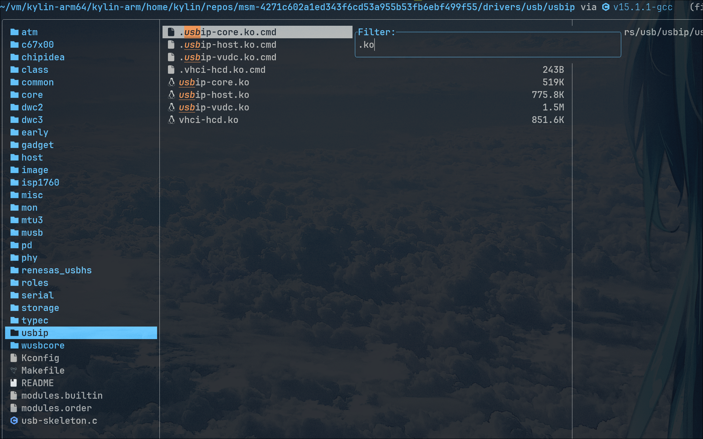

import Callout from "@components/Callout.astro";

---

## 背景

> https://android.googlesource.com/kernel/msm/+/refs/tags/android-11.0.0_r0.116/tools/usb/usbip/README

本次面向 RK-3568 盒子，编译的是安卓 11 系统的 usbip 模块

## 编译环境

我的环境是 Arch Linux，存在两个问题，第一是我的系统是 x86_64，cpu 架构不匹配，第二是我的系统 Glibc 版本太高，即使交叉编译出来，android 11 上也够呛能用。

所以我的做法是复用了之前适配飞腾 e2000 时做的基于麒麟系统的文件根目录做的 systemd-nspawn 的虚拟机

进入虚拟机后，参照官方 README 文档，先从 https://android.googlesource.com/kernel/msm/+/refs/tags/android-11.0.0_r0.116 下载了本次提交的 tgz 解压后，按照[Install]流程，将用户空间工具装好

然后编译 USB/IP 模块，需要进入到项目根目录，执行 make menuconfig，找到 USB/IP，使用空格将其改变为 \<M\>，

然后依次执行

```bash
make prepare scripts
make modules_prepare
make -j$(nproc) modules
```


需要注意，如果只运行 `make -j$(nproc) M=drivers/usb/usbip modules`，也可以生成内核模块，但会提示
```
    WARNING: Symbol version dump ./Module.symvers
    is missing; modules will have no dependencies and modversions.
```
> https://unix.stackexchange.com/a/24760

要先运行 `make modules` 才可生成模块依赖以及版本信息

成果展示（文件管理工具是 yazi）


